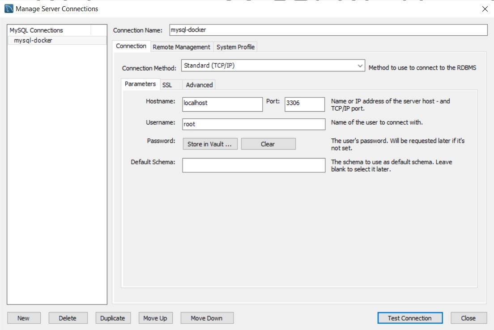
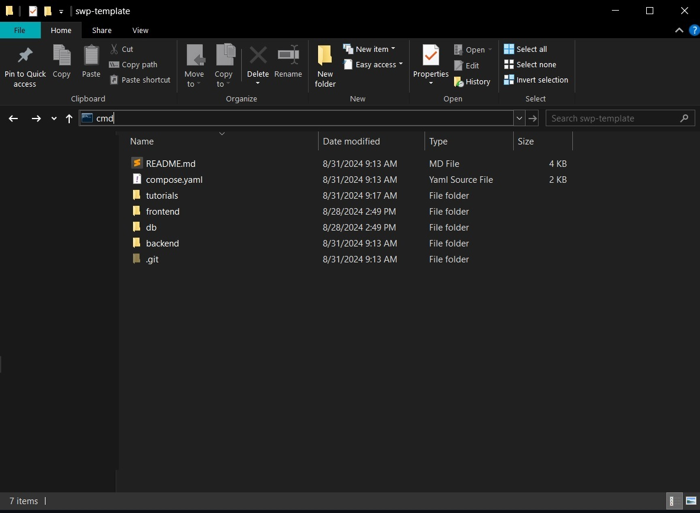
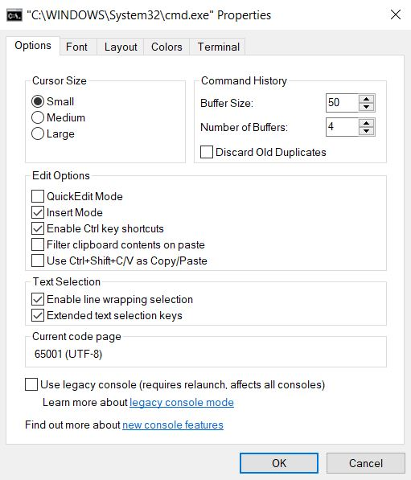
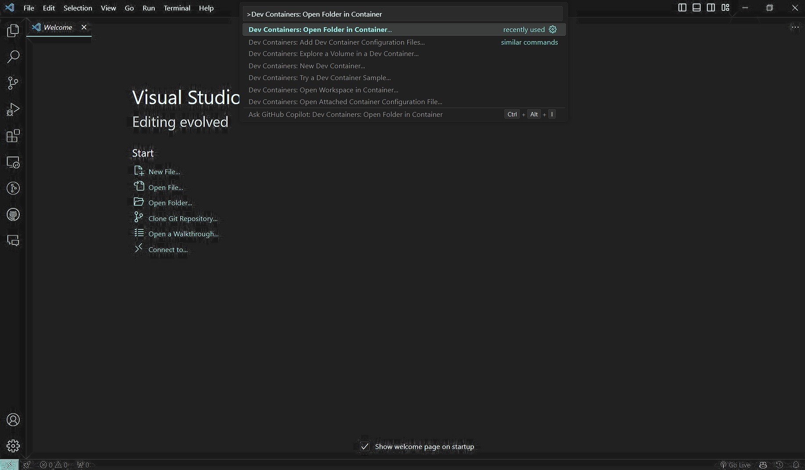
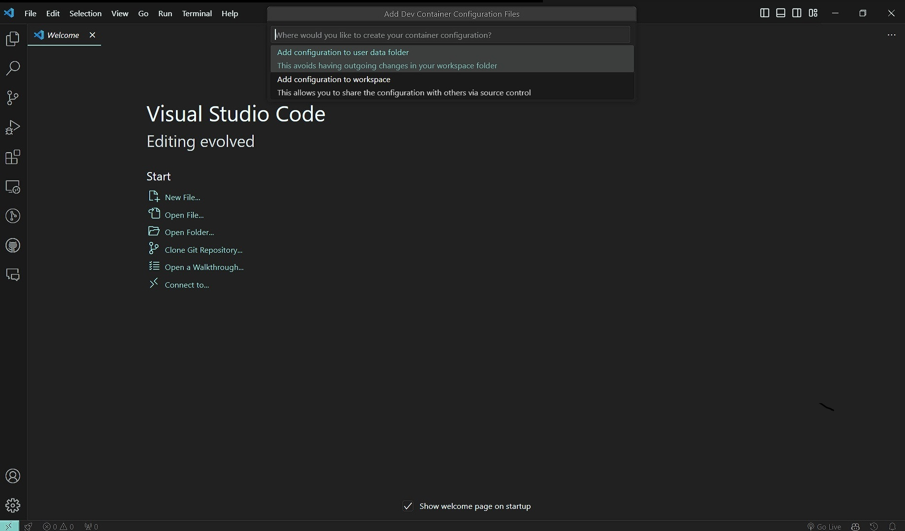
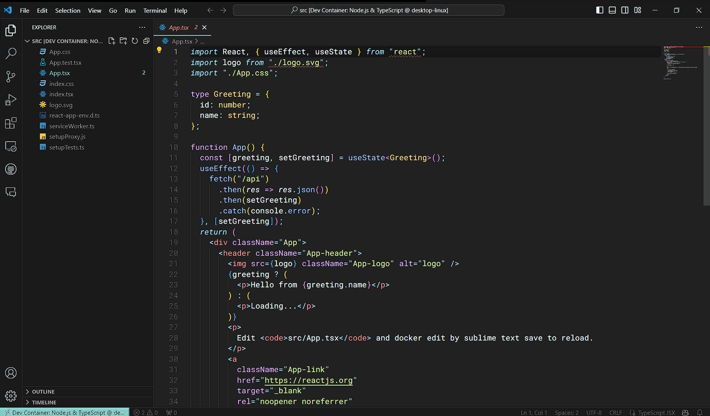

## FHD-Cinema
### Web app bán vé xem phim sử dụng React, Spring Boot và MySQL

## Thành viên
+ Phan Hải Đăng - HE181217
+ Phạm Nam Dương - HE181501
+ Nguyễn Đình Anh Đức - HE181048
+ Vũ Linh Trang - HE181187

Cấu trúc project
```
.
├── backend
│   ├── ...
│   └── Dockerfile
├── db
│   └── password.txt
├── frontend
│   ├── ...
│   └── Dockerfile
├── compose.yaml
└── README.md
```

## Chạy project bằng Docker

Tải về và cài đặt [Docker Desktop](https://www.docker.com/products/docker-desktop/)

Đứng từ folder chứa file [_compose.yaml_](compose.yaml), mở cmd và chạy lệnh

```
$ docker compose up -d --build
```
Kết quả trả về
```
Creating fhd-cinema-frontend-1 ... done
Creating fhd-cinema-db-1       ... done
Creating fhd-cinema-backend-1  ... done
```

Hướng dẫn cách điều hướng nhanh đến thư mục trên Windows xem tại [Phụ lục 1](#1-phụ-lục-1).

Hướng dẫn copy và dán lệnh trong cmd bằng Crtl-C/Crtl-V xem tại [Phụ lục 2](#2-phụ-lục-2).

Hướng dẫn sửa code trực tiếp trên container từ máy host xem tại [Phụ lục 3](#3-phụ-lục-3).

> ℹ️ **_CHÚ Ý_**
>
> Mỗi lần có code mới cũng chạy lại lệnh trên để update code trong các container
> 
> Docker sẽ mở cổng 3000, 3306 từ các container đến các cổng tương đương trên máy host
> 
> Hãy đảm bảo các cổng 3000, 3306 trên máy host không được sử dụng

## Kết quả mong muốn

Danh sách các container sau khi chạy

Sử dụng Docker Desktop để kiểm tra hoặc sử dụng cmd và chạy lệnh 
```
$ docker ps
```
Kết quả trả về
```
CONTAINER ID        IMAGE                       COMMAND                  CREATED             STATUS              PORTS                                NAMES
a63dee74d79e        fhd-cinema-backend      "java -cp app:app/li…"   39 seconds ago      Up 37 seconds       0.0.0.0:8080->8080/tcp                             swp-template_backend-1
6a7364c0812e        fhd-cinema-frontend     "docker-entrypoint.s…"   39 seconds ago      Up 33 seconds       0.0.0.0:3000->3000/tcp               swp-template_frontend-1
b176b18fbec4        mysql:8.0.36-debian       "docker-entrypoint.s…"   39 seconds ago      Up 37 seconds       0.0.0.0:3306->3306/tcp, 33060/tcp    swp-template_db-1
```


## Kiểm tra các cổng kết nối

Sau khi app chạy, kiểm tra url `http://localhost:3000` trên browser


Kiểm tra cổng 3306 của MySQL bằng MySQL Workbench với tài khoản `root` và mật khẩu trong [file password.txt](db/password.txt)



## Dừng project bằng Docker

Sử dụng Docker Desktop để huỷ hoặc sử dụng cmd và chạy lệnh

```
$ docker compose down
```
Kết quả mong muốn
```
Stopping fhd-cinema-backend-1  ... done
Stopping fhd-cinema-frontend-1 ... done
Stopping fhd-cinema-db-1       ... done
Removing fhd-cinema-backend-1  ... done
Removing fhd-cinema-frontend-1 ... done
Removing fhd-cinema-db-1       ... done
Removing network fhd-cinema-default
```

## Phụ lục
### 1. Phụ lục 1
Dùng File Explorer mở đến thư mục muốn chạy cmd, ghi từ `cmd` trên thanh địa chỉ và nhấn Enter.



### 2. Phụ lục 2
Mở cmd, chuột phải vào dòng chữ `cmd.exe` trên cửa sổ, chọn `Properties`

Config theo ảnh dưới



### 3. Phụ lục 3

> ℹ️ **_CHÚ Ý_**
>
> Việc sửa code trực tiếp trên container từ máy host không được khuyến khích
>
> Việc này chỉ có thể thực hiện dành cho folder [frontend/src](frontend/src)

Mở [Visual Studio Code](https://code.visualstudio.com/), cài extension [Dev Containers](https://marketplace.visualstudio.com/items?itemName=ms-vscode-remote.remote-containers)

Bấm phím `F1`, tìm `Dev Containers: Open Folder in Container`



Chọn folder [frontend/src](frontend/src)

Chọn option `Add configuration to user data store`



Sau đó cứ nhấn Enter và chờ đợi.

Kết quả có được




